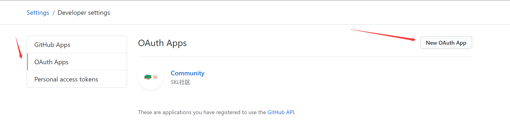

# blog-community
> 项目前后端不分离,前后端分离请看我另一个项目
> 有问题提issue,看到会回复
## 使用github和gitee授权登录
[github授权登录--Github OAuth](https://developer.github.com/apps/building-oauth-apps/creating-an-oauth-app/)
## 授权文档
[文档](https://developer.github.com/apps/building-oauth-apps/authorizing-oauth-apps/)

## 数据库
[h2:一个内嵌的数据库](https://www.h2database.com/html/main.html)
## 数据库迁移
[flyway](https://flywaydb.org/getstarted/) 
```sh
在pom中配置后可运行mvn flyway:migrate
```
## MyBatis Generator With Maven
```sh
mvn -Dmybatis.generator.overwrite=true mybatis-generator:generate

```

## github登录设置

没服务器回调地址可以写本地
```shell
github.client.id= 
github.client.secret =
github.redirect.uri = 
```

## markdown 编辑器
[Editor.md](https://pandao.github.io/editor.md/)

## markdown编辑器的图片上传
已经替换为阿里云oss了，在配置文件中设置

## 快速运行
```sh
cp 一个 application-production.properties 并填写相应配置
mvn flyway:migrate
mvn clean compile package 
java -jar -Dspring.profiles.active=production /target/xxxxx.jar
访问 http://localhost:8888
```
